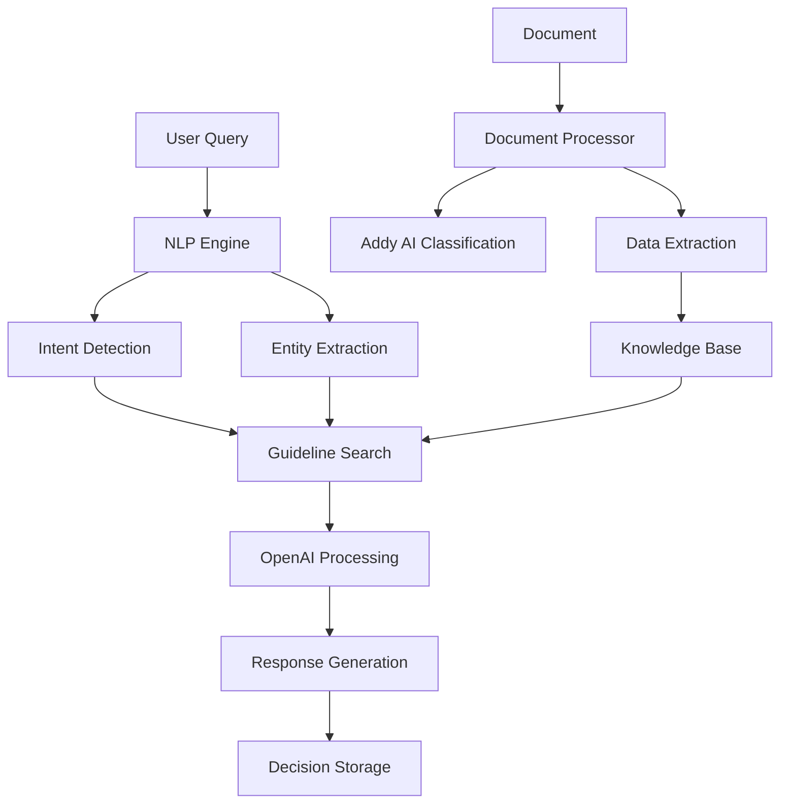

# Mortgage Guidelines NLP System - Technical Documentation

## System Overview

The Mortgage Guidelines NLP System is designed to process natural language queries about mortgage guidelines and provide accurate responses based on stored guidelines and AI-powered analysis.

### Core Components

1. **NLP Engine** (`nlp_engine.py`)
   - Handles natural language processing
   - Manages interactions with OpenAI and Supabase
   - Processes queries and generates responses

2. **Document Processor** (`document_processor.py`)
   - Processes PDF documents
   - Extracts structured data
   - Handles large document chunking
   - Implements Addy AI API integration for classification and extraction

3. **Knowledge Base Manager** (`knowledge_base.py`)
   - Manages guideline storage and retrieval
   - Handles document classification
   - Implements state and category detection
   - Provides export functionality

### Architecture



## Component Details

### 1. NLP Engine

#### Intent Detection
- Uses regex patterns to identify query types:
  - LTV inquiries
  - DTI inquiries
  - Credit score inquiries
  - State-specific queries
  - Property type queries

#### Entity Extraction
- Identifies key entities in queries:
  - States
  - Property types
  - Numerical values
  - Loan types

#### Guideline Search
- Searches Supabase for relevant guidelines
- Filters based on:
  - Query intent
  - State specificity
  - Category matching
- Implements relevance scoring

#### Response Generation
- Uses OpenAI GPT-4
- Provides context-aware responses
- Includes confidence scoring
- Handles API errors gracefully

### 2. Document Processor

#### Document Classification
- Integrates with Addy AI API
- Supports multiple document types:
  - Income documents (W2, 1099, etc.)
  - Asset documents
  - Property documents
  - Identity documents

#### Data Extraction
- Extracts structured data from documents
- Handles large files through chunking
- Implements retry logic
- Validates extracted data

### 3. Knowledge Base Manager

#### Guideline Management
- Fetches guidelines from multiple sources
- Detects document categories
- Identifies state-specific rules
- Maintains version control

#### Export Functionality
- Supports multiple formats:
  - CSV
  - JSON
  - Excel
- Includes metadata and timestamps

### Database Schema

```sql
-- Borrowers Table
CREATE TABLE borrowers (
    id UUID PRIMARY KEY,
    income NUMERIC,
    credit_score INTEGER,
    debt NUMERIC,
    property_value NUMERIC,
    extracted_data JSONB
);

-- Guidelines Table
CREATE TABLE guidelines (
    id UUID PRIMARY KEY,
    rule_name TEXT,
    rule_text TEXT,
    source TEXT,
    category TEXT,
    state TEXT,
    version_hash TEXT,
    last_updated TIMESTAMP,
    matrix_data JSONB
);

-- Loan Decisions Table
CREATE TABLE loan_decisions (
    id UUID PRIMARY KEY,
    borrower_id UUID,
    question TEXT,
    answer TEXT,
    confidence_score FLOAT,
    decision_date TIMESTAMP,
    metadata JSONB
);
```

## Testing

### Unit Tests
- Intent detection tests
- Entity extraction tests
- Response generation tests
- End-to-end query tests
- Document processing tests
- Knowledge base management tests

### Integration Tests
- Database interaction tests
- OpenAI API integration tests
- Document processing tests
- Addy AI API integration tests

### Real Data Testing
- Interactive testing script
- Sample query testing
- Custom query testing
- Document processing validation

## Environment Setup

Required environment variables:
```
SUPABASE_URL=your-project-url
SUPABASE_KEY=your-api-key
OPENAI_API_KEY=your-openai-key
ADDY_API_KEY=your-addy-key
```

## Dependencies

```
requests>=2.31.0
supabase>=2.3.0
python-dotenv>=1.0.0
PyPDF2>=3.0.0
tqdm>=4.66.0
openai>=1.0.0
regex>=2023.0.0
beautifulsoup4>=4.12.0
pandas>=2.0.0
```

## Usage Examples

```python
# Initialize the engine
engine = MortgageNLPEngine()

# Process a query
result = engine.process_query(
    "What is the maximum LTV for a single-family home in California?",
    borrower_id="user-123"
)

# Access results
print(result['answer'])
print(result['intent'])
print(result['entities'])
```

## Error Handling

The system implements comprehensive error handling:
1. API connection errors
2. Invalid query handling
3. Missing data handling
4. Database connection issues
5. Document processing errors
6. Large file handling
7. Invalid API key handling

## Performance Considerations

1. Document Processing
   - Chunking for large documents
   - Progress tracking
   - Memory management
   - Parallel processing

2. NLP Processing
   - Caching opportunities
   - Rate limiting
   - Response time optimization

3. Database Operations
   - Connection pooling
   - Query optimization
   - Batch processing

## Recent Improvements

1. Document Processing
   - Added Addy AI API integration
   - Implemented document classification
   - Enhanced error handling
   - Added progress tracking

2. Knowledge Base
   - Added state detection
   - Improved category matching
   - Added export functionality
   - Enhanced version control

3. Testing
   - Added real data testing
   - Enhanced mock implementations
   - Improved test coverage
   - Added integration tests

## Future Improvements

1. Performance
   - Implement caching layer
   - Add parallel processing
   - Optimize large file handling

2. Features
   - Add more document types
   - Enhance entity extraction
   - Implement guideline versioning
   - Add audit logging

3. Testing
   - Add performance benchmarks
   - Implement stress testing
   - Add security testing
   - Enhance coverage

4. Documentation
   - Add API documentation
   - Create user guides
   - Add deployment guides
   - Include troubleshooting guides

## Change Log

### Version 1.0.0 (Initial Release)
- Basic NLP engine implementation
- Document processing capabilities
- Test suite implementation
- Technical documentation 